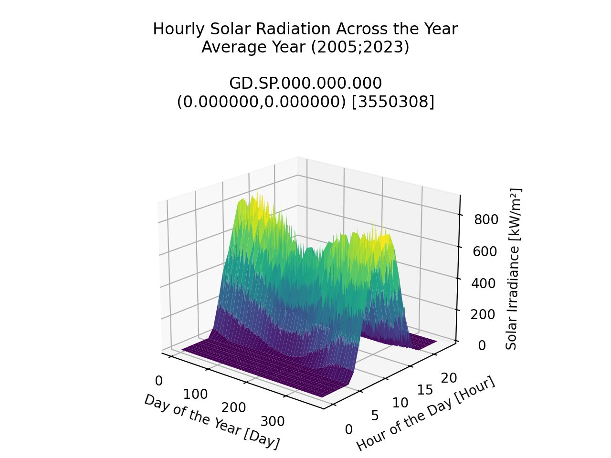

# PV Radiation vs Generation Analyzer  
<div align="center" style="display: flex; justify-content: space-between;">
  
  
</div

*[Hourly solar radiation vs. generation capacity | Hourly solar radiation across the year] - Sample photovoltaic venture (São Paulo, Brazil)*  

---

## Description  
This tool compares solar hourly radiation (from PVGIS) with photovoltaic generation capacity (from ANEEL ventures), factoring in system losses. It performs geospatial matching between energy projects and radiation data, then generates a comparative visualizations.

---

## Key Features  
- **🌍 Geospatial Coordination**  
  Matches ventures to nearest radiation coordinates using `scipy.spatial.cKDTree`  
- **📉 Loss Modeling**  
  Accounts for:
  - Temperature derating
  - Annual degradation
  - System losses
- **⚡ Parallel Processing**  
  Uses `multiprocessing` to handle large datasets  
- 📊 Visualization
  - Hourly radiation vs. generation curves
  - Key metrics overlay:
    - Total radiation energy (kWh/m²)
    - Generated energy (kWh)
    - System loss percentage  

---

## Usage
```python
from src.curve_generator import curve_generator
curve_generator(geocodes=[3550308])
# Analyze ventures in São Paulo, SP (geocode 3550308)
```
## Output Structure  
After   
```text
curves/  
└── SP/                  # State acronym (ex: SP = São Paulo)  
    └── [3501608]/       # IBGE city code (7 digits)  
        ├── CEG12345.png # Venture generation graph  
        └── CEG67890.png
```

## Dependent Repositories
This project relies on data processed by:
- [**ANEEL Photovoltaic Cleaner**](https://github.com/Mekepi/aneel-mmdg-photovoltaic-cleaner)  
  Provides cleaned ANEEL venture data in the required `gd-cities/` structure
- [**PVGIS Parallel API Client**](https://github.com/Mekepi/pvgis-parallel-api-client)  
  Generates radiation timeseries stored in `data v5.3/` directory structure

## Data Sources & Disclaimer

| Source | Description | License |
|--------|-------------|---------|
| [ANEEL GD Registry](https://dadosabertos.aneel.gov.br/dataset/relacao-de-empreendimentos-de-geracao-distribuida) | Photovoltaic venture metadata | [CC-BY 4.0](https://creativecommons.org/licenses/by/4.0/) |
| [PVGIS v5.3](https://re.jrc.ec.europa.eu/pvg_tools/en/) | Hourly radiation data | Non-commercial use |

Full details: [DATA_SOURCES.md](DATA_SOURCES.md)

## License
Code: [MIT License](LICENSE)  
[](https://opensource.org/licenses/MIT)

ANEEL Data: [CC-BY 4.0](https://creativecommons.org/licenses/by/4.0/)  
[](https://creativecommons.org/licenses/by/4.0/)
